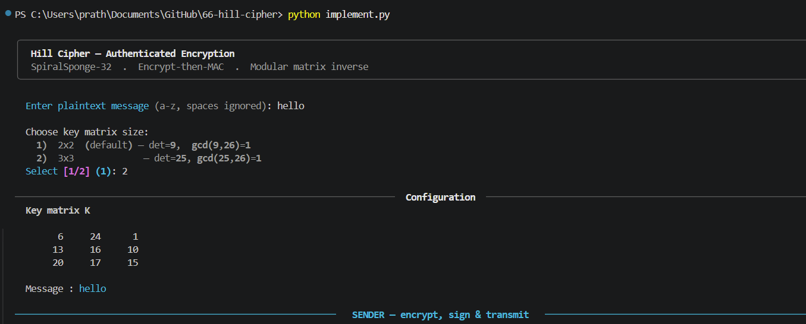
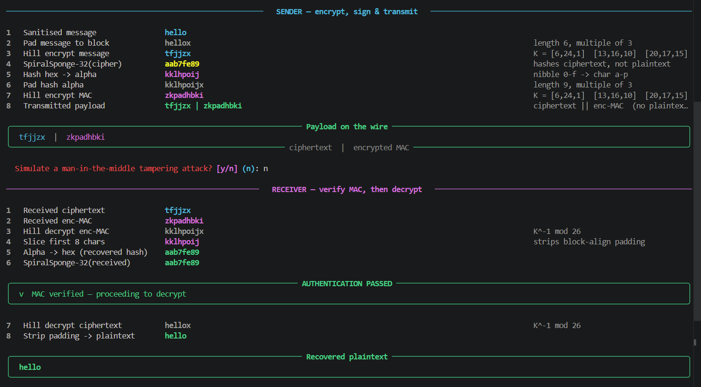
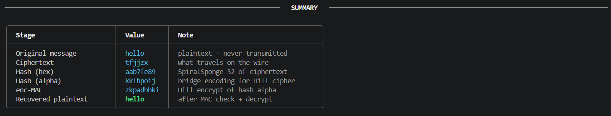

# Implementation of Hill Cipher with Authenticated Encryption

This repository contains a robust implementation of the Hill Cipher, enhanced with an Authenticated Encryption scheme (Encrypt-then-MAC). The system utilizes a custom SpiralSponge-32 hash function to ensure data integrity and authenticity, demonstrating a secure approach to classical cryptography.

## Project Description

The Hill Cipher is a polyalphabetic substitution cipher based on linear algebra. While mathematically significant, the standard Hill Cipher is vulnerable to ciphertext manipulation and known-plaintext attacks. This implementation mitigates these risks by incorporating a Message Authentication Code (MAC) to provide integrity and authenticity.

### System Capabilities
- **Multi-Order Support**: Implements Hill Cipher for both 2x2 and 3x3 key matrices.
- **Integrity via SpiralSponge-32**: Features a custom 32-bit sponge-based hash function with non-linear cross-diffusion to fingerprint ciphertext accurately.
- **Encrypt-then-MAC (EtM) Architecture**: Following modern security standards, the system hashes the ciphertext and encrypts the resulting digest to form a MAC.
- **Authentication Check**: The receiver performs a mandatory MAC verification before decryption. Any unauthorized modification to the ciphertext results in an authentication failure, preventing the decryption of tampered data.
- **Interactive Interface**: Developed using the `rich` library to provide a clear, step-by-step visualization of the cryptographic process.

---

## Terminal Outputs

The following figures illustrate the operational flow of the system:

### 1. Encryption and MAC Generation
The sender sanitizes the input, performs Hill encryption, and computes the MAC using the SpiralSponge-32 hash.


### 2. Payload Transmission and Verification
The payload, consisting of the ciphertext and the MAC, is verified by the receiver to ensure it was not modified during transit.


### 3. Execution Summary
A comprehensive summary detailing each stage of the cryptographic pipeline and the final plaintext recovery.


---

## Mathematical Foundation

### 1. The Hill Cipher Protocol
Encryption of a plaintext vector $P$ using a square key matrix $K$:
$$C \equiv K \cdot P \pmod{26}$$

Decryption using the modular multiplicative inverse of the matrix $K^{-1}$:
$$P \equiv K^{-1} \cdot C \pmod{26}$$

**Requirements for Key Validity**: The matrix $K$ must be invertible modulo 26. This condition is met if and only if:
$$\gcd(\det(K), 26) = 1$$

### 2. Authenticated Encryption Pipeline
To defend against active adversaries, the following Encrypt-then-MAC (EtM) sequence is employed:
1. **Encryption Phase**: $Ciphertext = Hill(Plaintext, K)$
2. **Hashing Phase**: $H = Hash(Ciphertext)$
3. **Authentication Phase**: $MAC = Hill(H, K)$
4. **Transmission**: The final payload is formatted as $(Ciphertext \parallel MAC)$.

Upon receipt, the system recomputed the hash of the ciphertext and validates it against the decrypted MAC. Discrepancies lead to immediate rejection of the message.

---

## Technical Setup

### Primary Dependencies
- Python 3.7 or higher
- `rich` library (for terminal visualization)

### Installation
```bash
pip install rich
```

### Execution
```bash
python implement.py
```

## Security Validation (Test Report)

The implementation was subjected to security testing involving bit-flip and substitution attacks on the ciphertext.

- **Attack Scenario**: A single character modification in the ciphertext (e.g., changing 'h' to 'j').
- **Observation**: The `SpiralSponge-32` hash exhibited a significant avalanche effect, producing a completely divergent digest.
- **Result**: The receiver successfully identified the MAC mismatch, aborted the decryption process, and flagged an authentication failure. This confirms the system's effectiveness in maintaining data integrity.
